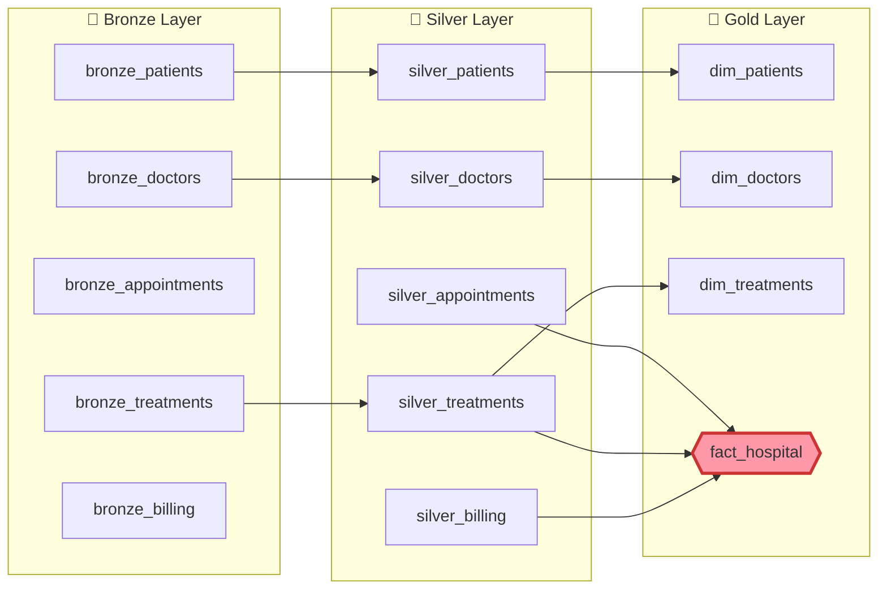

<div align="center">


# 🏥 Hospital Data Pipeline
### End-to-End Medallion Lakehouse on Azure Databricks

[](https://azure.microsoft.com/en-us/products/databricks)
[](https://spark.apache.org/)
[](https://delta.io/)
[](https://powerbi.microsoft.com/)
[](https://python.org/)

</div>

---

## 📌 Project Overview

This project showcases an **enterprise-grade, End-to-End Data Pipeline** built on **Azure Databricks** for a healthcare domain. Raw hospital data is ingested from multiple sources (REST APIs + flat files), processed at scale using **Apache Spark**, and structured into a **Medallion Architecture (Lakehouse)** with three distinct layers (Bronze → Silver → Gold) stored as **Delta Tables** — ultimately serving business-ready insights through **Power BI** dashboards.

---

## 🏗️ Architecture


The pipeline transitions data through three medallion layers, each stored as Delta Tables inside the **Unity Catalog** on Azure Databricks.

| Layer | Purpose | Storage Format |
|-------|---------|----------------|
| 🥉 Bronze | Raw landing zone — data as-is | Delta Table |
| 🥈 Silver | Cleaned, validated, structured | Delta Table |
| 🥇 Gold | Business-ready, Star Schema | Delta Views |

---

## 🛠️ Tech Stack

| Component | Technology |
|-----------|-----------|
| **Cloud Platform** | Microsoft Azure |
| **Compute & Processing** | Azure Databricks + Apache Spark |
| **Storage Format** | Delta Lake (Parquet-based) |
| **Catalog & Governance** | Unity Catalog (UC) |
| **Orchestration** | Databricks Workflows / Jobs |
| **BI & Visualization** | Power BI (DirectQuery / Import Mode) |
| **Data Sources** | REST APIs (GitHub), Flat Files (CSV) |
| **Language** | Python (PySpark), SQL |

---

## 📂 Project Structure

```
hospital-data-pipeline/
│
├── notebooks/
│   ├── Bronze_layer.ipynb        # Data ingestion → Raw Delta Tables
│   ├── Silver_layer.ipynb        # Transformation & Cleansing
│   └── Gold_layer.ipynb          # Business Logic → Star Schema Views
│
├── image/
│   ├── Design_Pipeline.png
│   ├── schema_Design.png
│   ├── run_pipeline.png
│   ├── add_triggers.png
│   ├── load_data_silver.png
│   ├── photo_bronze_load_data_in_catalog.png
│   ├── upload_data_files_to_volume.png
│   ├── conncation_to_Power_bi_.png
│   └── dashboard_1.png
│
└── README.md
```

---

## 🔄 Medallion Data Journey

### 🥉 Step 1 — Bronze Layer (Raw Data Ingestion)

The Bronze layer is the **landing zone**: data arrives exactly as-is from sources — no transformations applied. This guarantees full historical traceability and replayability.

**Data Sources:**

| Table | Source Type | Method |
|-------|-------------|--------|
| `bronze_patients` | REST API (GitHub) | `pd.read_csv(url)` → Spark DF |
| `bronze_treatments` | REST API (GitHub) | `pd.read_csv(url)` → Spark DF |
| `bronze_appointments` | Volume (CSV) | `spark.read.csv(volume_path)` |
| `bronze_doctors` | Volume (CSV) | `spark.read.csv(volume_path)` |
| `bronze_billing` | Volume (CSV) | `spark.read.csv(volume_path)` |

All tables are tagged with a `Data_Source` column to track their origin, then written as **Delta Tables** to `hospital.healthlycare.*`.

```python
# Example — Ingest from API + Volume, tag source, write to Bronze
df_patients = spark.createDataFrame(pd.read_csv(url_patients))
df_patients = df_patients.withColumn("Data_Source", lit("API"))
df_patients.write.mode("overwrite").format("delta").saveAsTable("hospital.healthlycare.bronze_patients")
```

**Catalog after Bronze load:**


---

### 🥈 Step 2 — Silver Layer (Transformation & Cleansing)

The Silver layer is the **trusted source of truth**. Spark jobs read from Bronze, apply strict data quality rules, and produce clean, structured Delta Tables.

**Transformations Applied:**

| Entity | Transformation |
|--------|---------------|
| **Patients** | `F`/`M` → `Female`/`Male` · `first_name` + `last_name` → `Full_Name` · `date_of_birth` cast to `DateType` · Null checks on `patient_id` |
| **Doctors** | `first_name` + `last_name` → `Full_Name` |
| **Treatments** | `cost` rounded to 1 decimal place |
| **Appointments** | `appointment_time` reformatted to `hh:mm a` · `transaction_id` generated using `monotonically_increasing_id()` |
| **Billing** | `amount` rounded to 1 decimal place |

```python
# Example — Patients cleansing
patients = patients.replace("F", "Female", subset="gender").replace("M", "Male", subset="gender")
patients = patients.withColumn("Full_Name", concat_ws(" ", col("first_name"), col("last_name")))
patients = patients.withColumn("date_of_birth", to_date(col("date_of_birth"), "yyyy-MM-dd"))
```

**Silver tables loaded to catalog:**


---

### 🥇 Step 3 — Gold Layer (Business-Ready Star Schema)

The Gold layer applies **business logic and aggregations**, modelling data into a **Star Schema** optimised for Power BI reporting.

**Schema Design:**


**Gold Objects Created (as Delta Views):**

```
hospital.healthlycare
├── fact_hospital          ← Central fact table (appointments + billing + treatments)
├── dim_patients           ← Patient dimension
├── dim_doctors            ← Doctor dimension
└── dim_treatments         ← Treatment dimension
```

**Data Flow (Bronze → Silver → Gold):**



---

## ⚙️ Pipeline Orchestration

The three notebooks are chained as a **Databricks Workflow** (Jobs & Pipelines) with a scheduled trigger.

**Pipeline Tasks:**

```
Bronze_layer  ──►  Silver_layer  ──►  Gold_layer
```

**Trigger:** Every 5 minutes, starting at 4 minutes past the hour (configurable).

**Tasks view:**


**Schedules & Triggers:**


**Successful Runs:**

All three layers ran successfully — both manually triggered and by the scheduler (57s avg runtime).

---

## 📤 Data Loading to Unity Catalog Volume

Source CSV files (appointments, billing, doctors) are uploaded directly to a **Databricks Unity Catalog Volume** before ingestion:

```
/Volumes/hospital/healthlycare/healthly_volume/
├── appointments.csv
├── billing.csv
└── doctors.csv
```


---

## 📊 Power BI Integration

The Gold layer is connected to **Power BI Desktop** via the native Azure Databricks connector. All 14 tables (Bronze + Silver + Gold) are visible and selectable in the Power BI Navigator.

**Connection:** `dbc-fec0963f-c546.cloud.databricks.com` → `hospital.healthlycare`


**Dashboard Preview:**


---

## 🗄️ Unity Catalog Structure

```
hospital (Catalog)
└── healthlycare (Schema)
    ├── Tables (10)
    │   ├── bronze_appointments
    │   ├── bronze_billing
    │   ├── bronze_doctors
    │   ├── bronze_patients
    │   ├── bronze_treatments
    │   ├── silver_appointments
    │   ├── silver_billing
    │   ├── silver_doctors
    │   ├── silver_patients
    │   └── silver_treatments
    ├── Views (4)
    │   ├── dim_doctors
    │   ├── dim_patients
    │   ├── dim_treatments
    │   └── fact_hospital
    └── Volumes (1)
        └── healthly_volume
```

---

## 🚀 How to Run

1. **Upload source files** to the Unity Catalog Volume:
   - `appointments.csv`, `billing.csv`, `doctors.csv` → `/Volumes/hospital/healthlycare/healthly_volume/`

2. **Run notebooks in order** (or trigger the Workflow):
   ```
   Bronze_layer.ipynb  →  Silver_layer.ipynb  →  Gold_layer.ipynb
   ```

3. **Connect Power BI** using the Azure Databricks connector:
   - Server: your Databricks workspace URL
   - HTTP Path: your SQL Warehouse HTTP path
   - Select tables from `hospital.healthlycare`

4. **(Optional) Schedule the pipeline** via Databricks Jobs with a cron trigger.

---

## 👤 Author

**Ahmed Ramadan Ismail**  
Data Engineer | Azure Databricks | Apache Spark | Delta Lake

[](https://github.com/Ahmed-Ramadan-Ismail)

---

<div align="center">
<sub>Built with ❤️ using Azure Databricks · Apache Spark · Delta Lake · Power BI</sub>
</div>
